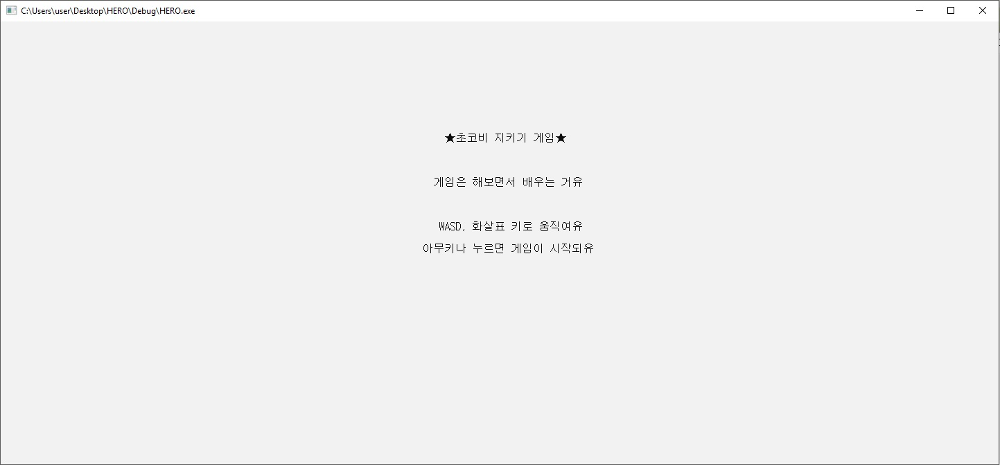

# C_game_project
한국디지털미디어고등학교 게임 수행

### 초코비 지키기 게임

***

#### 게임 개요

내 동생이 가장 좋아하는 만화가 “짱구는 못말려” 이다.

이번에 콘솔 게임을 만들면서 어떤 게임을 만들어 볼까 구상하다가 동생을 위한 게임을 만들어 보기로 하였고, 만들게 된 게임이 “초코비 지키깅~”이라는 전략 게임이다. 

이 게임은 내가 동생이 두 명인 까닭에 2인용 게임으로 만들었으며, 두 명의 플레이어가 게임 맵에 랜덤으로 떨어지는 초코비를 상대편으로부터 지켜 상대보다 빨리 초코비 7개를 가져가는 게임이다. 

#### 게임 방법

게임을 시작하면 처음에 짱구 얼굴 인트로가 나오는데, 아무키나 누르면 게임 타이틀이 나타난다. 

타이틀이 나타난 후 3초 정도 뒤에 본격적으로 게임에 들어가며, 게임 플레이 방법에 대한 설명이 간단하게 나온다. 게임 설명 창에서 아무 키를 누르면 캐릭터 선택 창으로 넘어가고, 캐릭터를 선택할 수 있게 된다. 

플레이어 1이 먼저 캐릭터를 선택할 수 있고 플레이어 1이 캐릭터를 선택하면 플레이어 2가 캐릭터를 선택한 후에 바로 게임이 시작된다. 

게임은 플레이어 1이 WASD키를 이용하여 캐릭터를 움직이고, 

플레이어 2가 ↑←↓→화살표 키를 이용하여 움직인다. 

두 캐릭터가 맵에 랜덤으로 생기는 초코비를 상대로부터 지켜 가져가는 게임이며, 벽의 끝에 가면 반대편 벽으로 나오기 때문에 최단경로를 생각하여 상대보다 빨리 초코비를 가져가는 전략 게임이라고 할 수 있다. 

#### 제작 시 어려웠던 문제

만든 게임은 2인용 게임인데, 플레이어의 캐릭터를 움직이게 하기 위해 처음에 학교에서 배운 대로 _kbhit()을 통해 키보드가 눌렸는지 확인하고, _getch()를 이용하여 눌린 키 값을 가져오는 식으로 프로그래밍 하였다. 

하지만 이러한 방법으로 하였을 때, 눌린 키의 값을 하나만 가져와 처리할 수 있어서 플레이어 두명이 동시에 동작되지 않고, 플레이어 한명의 키가 눌려 있는 동안 다른 플레이어의 키 값을 읽어올 수 없어 움직일 수 없는 문제가 생겼다.  

#### 해결 내용

이 문제를 해결하기 위해 c언어에서 다중 키 입력을 받을 수 있는 방법을 찾아봤다. 

첫번째로 생각한 방법은 _getch()의 값을 저장할 변수를 두개 두어 각각의 값을 받아 플레이어에 맞게 각각 처리하려고 하였으나, _getch()를 중복하여 동시에 입력을 받을 수 없었고, 플레이어 한명이 움직일 때에도 두개의 키를 누르면 대각선 방향으로 가지 않고, 한 방향으로 만 가는 문제가 있었다. 

두번째 방법으로 Win32 윈도우 프로그래밍을 이용해 프로그램 하여 LRESULT CALLBACK WndProc( HWND, UNIT, WPARAM, LPARAM) 콜백함수를 이용하여 키값을 입력받고 배열을 하나 만든 다음, 그 키의 10진수 값에 맞는 칸에 눌리면 TRUE, 눌리지 않으면 FALSE의 BOOL변수 형태로 저장해 필요한 정보를 가져와 이용하려고 했으나, 윈도우 프로그래밍에 관한 지식이 부족하여 이 방법을 이용하지 못했다. 

마지막 방법으로 인터넷에서 찾아본 결과 GetAsyncKeyState함수에 대해 알게 되었다. 이 함수는 키보드가 물리적으로 눌렸는지 아닌지 알려주는 함수이다. 이 함수를 이용하여 키의 상태를 확인하고, 눌렸으면 그 키에 맞는 이벤트가 실행되도록 하여 문제를 해결하고, 두 플레이어가 동시에 움직일 수 있고, 대각선으로도 이동 가능하게 하였다. 

#### 게임 소개

+ 게임 인트로 시작 화면

+ 게임 제목 화면

+ 게임  소개 화면

+ 게임 캐릭터 선택 화면

+ 게임 플레이 화면

+ 게임 엔딩 화면

